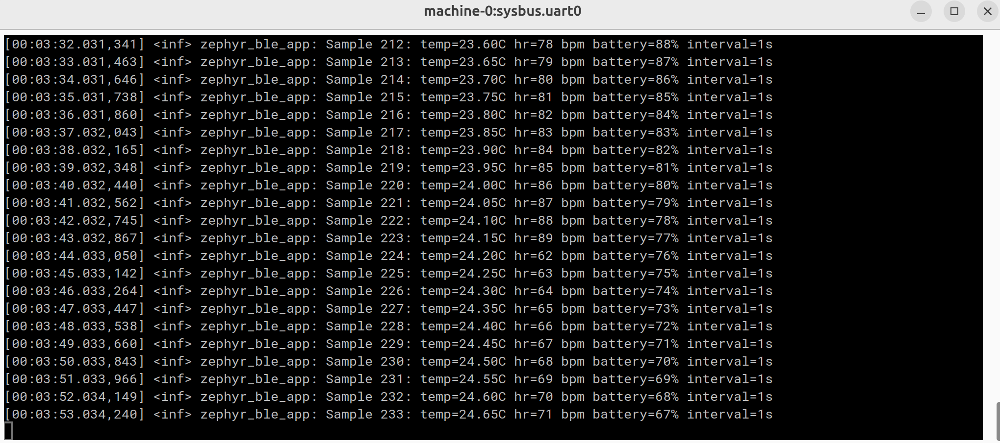
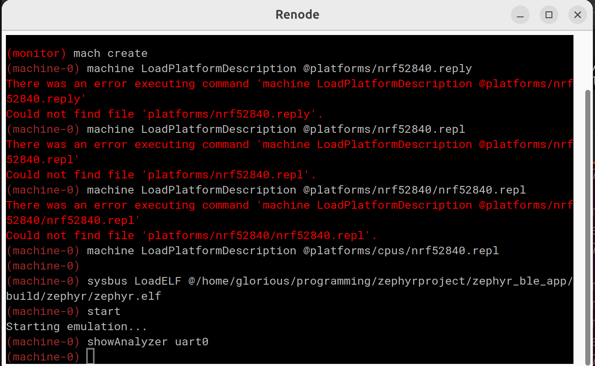

# Zephyr UART Telemetry App

This application was originally designed for BLE broadcasting, but **Bluetooth support has been fully removed**.
The firmware now outputs aircraft telemetry **exclusively over UART**, which is ideal for Renode simulation and socket‑based telemetry streaming.

This app is configured for a local Zephyr workspace checkout.

---

## Default behavior

- Uses the sibling Zephyr tree at `../zephyr` when `ZEPHYR_BASE` is not set.
- Defaults to the `native_sim` board so CMake configure works without BabbleSim.
- Uses `../.venv/bin/python` automatically when that virtualenv exists.
- Uses the workspace-local Zephyr SDK copy in `../.zephyr-sdk-1.0.1` when present.

---

## Setup

```sh
cd /path/to/zephyrproject
python3 -m venv .venv
. .venv/bin/activate
python -m pip install -r zephyr/scripts/requirements-base.txt
```

---

## Build requirements

- The workspace includes a local Zephyr SDK copy in `.zephyr-sdk-1.0.1`.
- If you remove that copy, install Zephyr SDK 1.0.1 and point `ZEPHYR_SDK_INSTALL_DIR` at it.

---

## Configure/build examples

```sh
cd /path/to/zephyrproject
. .venv/bin/activate
cmake -S zephyr_ble_app -B build/zephyr_ble_app -DBOARD=native_sim -DZEPHYR_BASE="$PWD/zephyr"
cmake --build build/zephyr_ble_app
```

If you want the BabbleSim target instead, use `nrf52_bsim` and provide BabbleSim:

```sh
cd /path/to/zephyrproject
. .venv/bin/activate
BSIM_COMPONENTS_PATH=/path/to/bsim/components BSIM_OUT_PATH=/path/to/bsim/out \
    cmake -S zephyr_ble_app -B build/zephyr_ble_app -DBOARD=nrf52_bsim -DZEPHYR_BASE="$PWD/zephyr"
```

If `west` is installed in the virtualenv, you can also build with:

```sh
cd /path/to/zephyrproject
. .venv/bin/activate
west build -p always -b native_sim zephyr_ble_app
```

---

## Stand-alone console simulation

`src/sim.c` is a stand-alone, console-only simulation that prints the same aircraft telemetry values your Zephyr firmware now outputs over **UART**.

### Run it

```sh
cd /path/to/zephyrproject/zephyr_ble_app
gcc src/sim.c -o sim -lm
./sim
```

---

# Running the Project

This project can run in two ways:

- **Locally on your computer** (using Zephyr’s `native_sim` board)
- **Inside Renode** (simulating the nRF52840 DK)

Both methods are described below.

---

## Running Locally (native_sim)

> ⚠️ **Note:**
> BLE support has been removed.
> The firmware now prints telemetry over **UART only**, even when running locally.

### Steps

0. Create and activate virtualenv:

   ```sh
   cd /path/to/zephyrproject
   python3 -m venv .venv
   . .venv/bin/activate
   python -m pip install -r zephyr/scripts/requirements-base.txt
   ```

1. Enter your project directory:

   ```sh
   cd zephyr_ble_app
   ```

2. Build for the native simulator:

   ```sh
   west build -b native_sim -p always
   ```

3. Run the executable:

   ```sh
   ./build/zephyr/zephyr.exe
   ```

You should see UART-style telemetry output, for example:

```text
Aircraft 1234ABCD: lat=... lon=... alt=... speed=... heading=...
```

---

## Running in Renode (nRF52840 simulation)

This method simulates the nRF52840 DK and runs the firmware exactly as on real hardware.

### Steps

0. Virtualenv:

   ```sh
   cd /path/to/zephyrproject
   python3 -m venv .venv
   . .venv/bin/activate
   python -m pip install -r zephyr/scripts/requirements-base.txt
   ```

1. Build the firmware for the nRF52840 DK:

   ```sh
   cd zephyr_ble_app
   west build -b nrf52840dk/nrf52840 -p always
   ```

2. Start Renode in server mode with the script:

```bash
renode --server-mode --server-mode-port 5555 renode-websocket.resc
```

The script loads the nRF52840 platform, loads `build/zephyr/zephyr.elf`, opens
`uart0`, and starts execution automatically.
Renode exposes the UART as a WebSocket endpoint, which your simulation environment can connect to.

You should now see live UART telemetry output, for example:

```text
Aircraft 1234ABCD: lat=... lon=... alt=... speed=... heading=...
```




---

# Notes

```
renode --disable-xwt --console "/path/to/zephyrproject/zephyr_ble_app/renode-websocket.resc"
```

```
(machine-0)
sysbus.uart0 DumpHistoryBuffer
```

```
ss -tlnp | grep 4321
```
